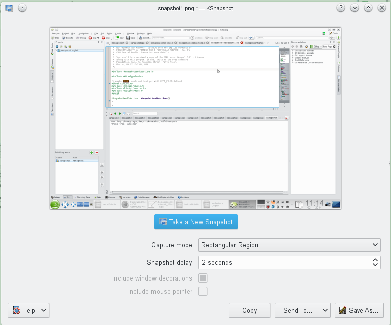

dev - Open issues
=================

KF5: buttons invisible but clickable
------------------------------------
dev env: running Plasma 4 on openSUSE 13.1, KDE version 4.11.5
use latest frameworks build: 2014-11-02

The invisible buttons are functional if you know where they are.

Restart application a few times. There is no pattern when the buttons are visible or not.

The following screenshots show on the left side: missing buttons. On the right side: buttons as expected:

```$ kcmshell5 mouse```


```$ ksnapshot```



