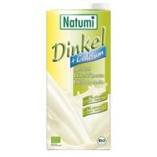
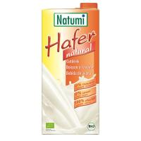
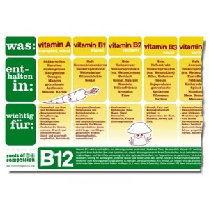
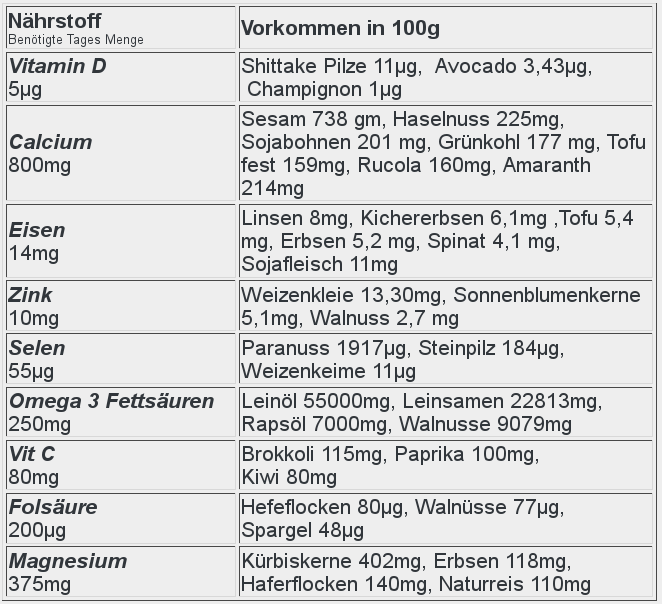

foodstructs basics
==================

Bausteine
---------
Sammlung von Zutaten aus denen sich leckere Dinge machen lassen:

  * Süßkartoffeln
  * Sprossen, Trip to India
  * Nüsse (Hasel, Wal, Para, Erd)
  * ...

X-Drinks
--------
Hintergrund: "Im Handel in der Europäischen Union darf mit „Milch“ nur Milch von Kühen bezeichnet werden."
(16.06.2014, https://de.wikipedia.org/wiki/Milch)

Bei den X-Drinks steht das X für

  * Hafer
  * Dinkel
  * Soja
  * Reis
  * Mandel
  * Dinkel/Mandel
  * Reis/Kokos
  * jeweils mit oder ohne Zusatz von
    * Kalzium
    * Zucker (nicht empfohlen)
    * Schoko oder Vanille

etc.

Pudding
-------
Siehe bekanntes Pudding-Rezept, aber mit X-Drink statt Milch, wobei X nach Geschmack zu wählen ist.

Heißer Kakao mit X-Drink
------------------------
Analog zum Pudding.

Nährstofftabelle 1
------------------
von [roots of compassion](http://www.rootsofcompassion.org/de/vegane-ernaehrungstabelle)

Nährstofftabelle 2
-------------------
Quelle: extravegant.de, abgerufen 08.03.2014

