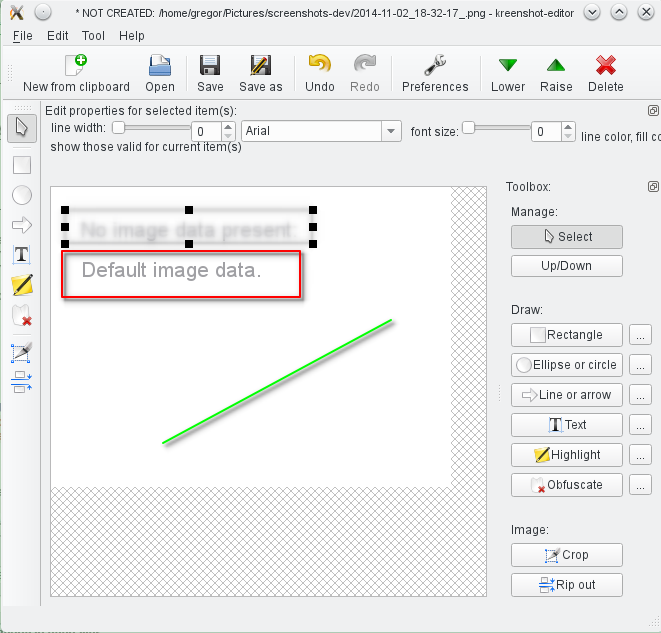
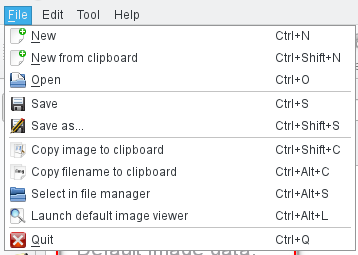
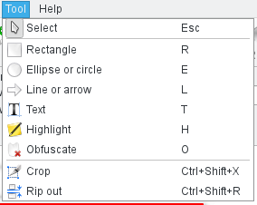
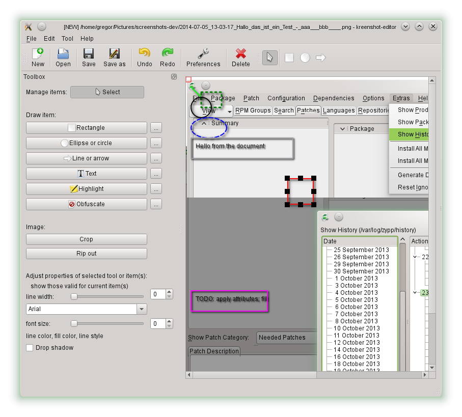
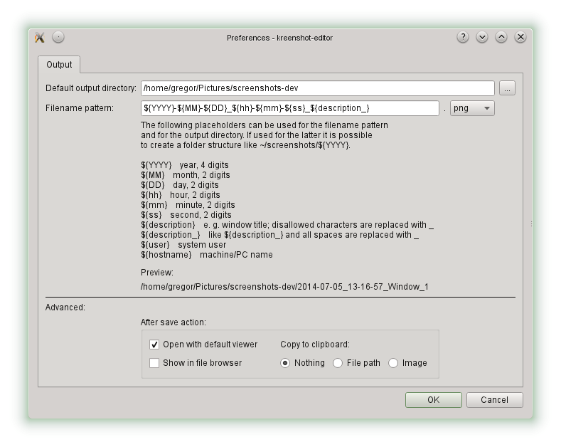

Kreenshot Editor
================
kreenshot-editor -- **screenshot image editing**

Note! kreenshot-editor is *INCUBATING* and not yet ready for production use. Target schedule for first release: end of 2014.

kreenshot-editor is written in Qt 5.3 with Linux as target platform.

Target features
---------------

  * Image editing optimized for screenshots. Common editing and annotation tasks that occur when dealing with screenshots:
    * Draw objects and move or resize later
      * rectangle
      * ellipse
      * line
      * arrow
      * text
      * Optional drop shadow for objects
      * later: create a free-hand drawing object
    * Rectangular image operation objects
      * highlight
      * obfuscate
      * Movable and resizeable
    * Crop
    * Undo/Redo
  * Command line interface to integrate it in other screenshot tools that have no own image editor.
    * Example: ```kreenshot-editor --treat-as-new "/tmp/image1.png" --description "Hallo das ist ein Test - aaa \ bbb ///"```
    * Give a secondary image as parameter. This can be used to pass the captured mouse cursor as extra object so the user can move or delete it.
    Thus, the mouse cursor can always be captured and the user decides later.
  * Provide a QWidget component to seemlessly integrate in other screenshot tools
  * Save image to default location with placeholders for date, time etc.

Code
----
(incubating)

  * Source code hosted on [KDE quickgit](http://quickgit.kde.org/?p=scratch%2Fgregormi%2Fkreenshot-editor.git)
    * inital commit 2014-05-01
  * [README](http://quickgit.kde.org/?p=scratch%2Fgregormi%2Fkreenshot-editor.git&a=blob&f=README.md) with build instructions and current TODOs and open issues.

### Details

  * Widget toolkit: Qt 5.3 (http://qt-project.org/)
    * based on QGraphicsView, QGraphicsScene, QGraphicsItem
  * Primary programming language: C++
  * Build system: cmake
  * Snapshot binary package for openSUSE: http://software.opensuse.org/package/kreenshot-editor

Why?
----

A screenshot tool in general comprises of three parts:

  1. Capture image from screen.
  2. Edit image in some way (optional).
  3. Save image in a standardized user defined way to disk or export it other ways.

kreenshot-editor aims to support the user with task No. 2 and 3.

One goal is to help fixing this [ksnapshot](https://www.kde.org/applications/graphics/ksnapshot/) issue: [Bug 268260 - WISH - Add basic draw functions](https://bugs.kde.org/show_bug.cgi?id=268260)

Inspired by: [Greenshot](http://getgreenshot.org/)

Screenshots
-----------
### dev state 2014-11-02




### dev state 2014-07-05



Contribute
----------
todo: Create a https://git.reviewboard.kde.org/groups/ group, create a https://bugs.kde.org/ product.
Until this is done, look into the source code for my email address and leave me a message.
