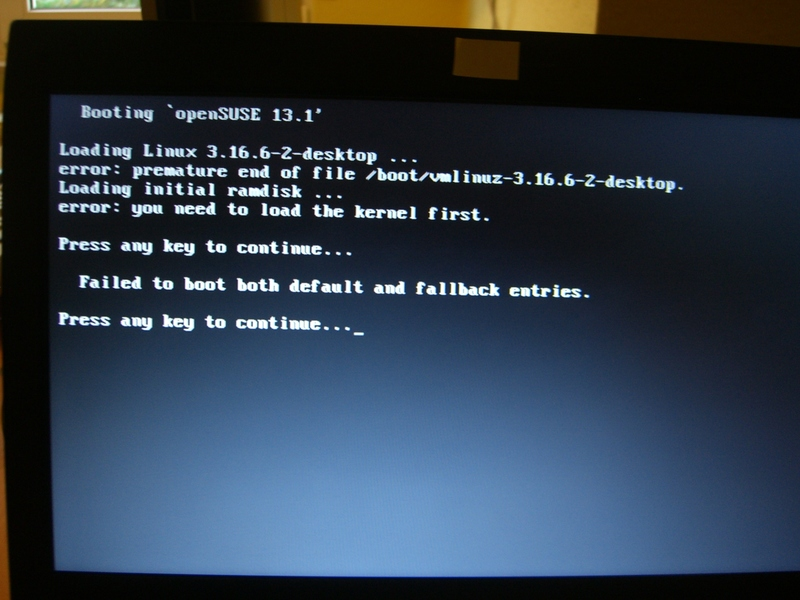

Linux beginners notes
=====================

All the things I noticed when switching my home computer from Windows 7 to openSUSE Linux 13.1.

TODO: move from here: http://publicstatic.de/gnu/linux/todo-and-solved.html

openSUSE: upgrade from 13.1 to 13.2
-----------------------------------

Upgrading a distribution: https://en.opensuse.org/SDB:System_upgrade

### Making sure you are up to date

* `sudo zypper repos --uri` list all repos with URIs
* `sudo zypper refresh` refreshes all repos
    * in case of errors: `sudo zypper removerepo http-download.opensuse.org-436383ff`
* `sudo zypper modifyrepo --enable repo-update`
* `sudo zypper modifyrepo --disable 1 2 7`
* Prepare:
    `sudo zypper refresh`
    `sudo zypper update`
* Restart computer
* Defects:
    * VLC does not show images
    * USB sound card makes crazy sounds instead of being normal

This might have something to do with updated packages:
```
vlc-beta-qt-3.0.0-2014102201.3.x86_64         Sat 08 Nov 2014 10:29:18 CET
vlc-beta-gnome-3.0.0-2014102201.3.x86_64      Sat 08 Nov 2014 10:29:18 CET
vlc-beta-aout-pulse-3.0.0-2014102201.3.x86_64 Sat 08 Nov 2014 10:29:18 CET
vlc-beta-3.0.0-2014102201.3.x86_64            Sat 08 Nov 2014 10:29:18 CET
vlc-beta-noX-3.0.0-2014102201.3.x86_64        Sat 08 Nov 2014 10:29:17 CET

gstreamer-0_10-plugins-ffmpeg-0.10.13-2000.4.x86_64 Sat 08 Nov 2014 10:29:07 CET

mpeg2dec-0.5.1-3.1.x86_64                     Sat 08 Nov 2014 10:28:57 CET
gstreamer-0_10-plugins-ugly-orig-addon-0.10.19-14.2.x86_64 Sat 08 Nov 2014 10:28:57 CET

gstreamer-0_10-plugins-fluendo_mpegmux-0.10.4-46.2.x86_64 Sat 08 Nov 2014 10:28:54 CET

mp4v2-2.0.0-1.6.x86_64                        Sat 08 Nov 2014 10:28:51 CET

gstreamer-0_10-plugins-fluendo_mpegdemux-0.10.71-2.6.x86_64 Sat 08 Nov 2014 10:28:38 CET

libvlccore8-3.0.0-2014102201.3.x86_64         Sat 08 Nov 2014 10:27:43 CET
libvlc5-3.0.0-2014102201.3.x86_64             Sat 08 Nov 2014 10:27:43 CET
libmpeg2convert0-0.5.1-8.1.x86_64             Sat 08 Nov 2014 10:27:43 CET
libmp4v2-0-2.0-2.14.x86_64                    Sat 08 Nov 2014 10:27:43 CET
...
```

* Install `vlc` instead of `vlc-beta` fixes video output but sound still is ear-destroying.
* Unplug and replug USB sound card fixes sound.

### Running the upgrade
... see https://en.opensuse.org/SDB:System_upgrade ...
"As already mentioned, any third party or OBS repositories can cause troubles, so it is recommended to disable or remove them before proceeding."
Also disable the CD repo.
Disable all repos with URL http://download.opensuse.org/repositories/*

`sudo cp -Rv /etc/zypp/repos.d /etc/zypp/repos.d.Old`
`sudo sed -i 's/13\.1/13.2/g' /etc/zypp/repos.d/*`
`sudo zypper ref`

"It is strongly recommended that you run this inside GNU screen or tmux to protect the upgrade process in case anything should go wrong with the X session during the upgrade."

`sudo zypper install tmux`
http://tmux.sourceforge.net/
[man page](http://www.openbsd.org/cgi-bin/man.cgi/OpenBSD-current/man1/tmux.1?query=tmux&sec=1)

Quick howto tmux:

* `tmux`
    * Do something inside tmux
    * Press **Ctrl+B D** to detach current client
     `[detached (from session 0)]`
* `tmux attach -t 0` to attach again to session 0 or just `tmux attach` to attach to last session
* `tmux ls` to list all sessions
* reminder: press **Ctrl+Alt+F6** to switch away from X to console and **Ctrl+Alt+F7** to go back to X.

`zypper help dup` - "Perform a distribution upgrade."

`zypper dup --download "in-advance"` - Performs the update

This will ask before continuing.
Check the console output (/home/gregor/sys/upgrade_13.1_13.2/zypper_dup.out.txt) for REMOVED or DOWNGRADED packages to know what will be missing later.

Downloading 5106 packages... done

Installing packages... done

(I leave third-party repos still disabled.)

### Reboot and afterwork

"After upgrade, reboot is recommended to start new kernel and newer versions of everything."

Try to reboot but the system did not boot anymore because kernel was not found. See next section about how to fix boot problems. Now fixed.

After successful reboot: Using KDE Development Platform 4.14.2.

Yast Online Update Installation Summary wants to install ibus. (Note that previously it messed up with Firefox KDE integration)

"In addition, `zypper up` can be run from time to time to ensure you have the latest available packages from the various repositories that you have enabled. YOU (Yast Online Update) only addresses security updates from the official repositories."

Run `sudo zypper dup` again which removes about 150 libraries.

Open "YaST2 - Bootloader" and fix distributor text from "13.1" to "13.2"

Install video codecs (see http://opensuse-guide.org/codecs.php):
```
zypper addrepo -f http://ftp.gwdg.de/pub/linux/packman/suse/openSUSE_13.2/ packman
zypper addrepo -f http://opensuse-guide.org/repo/13.2/ dvd
zypper install libxine2-codecs k3b-codecs ffmpeg lame gstreamer-plugins-bad gstreamer-plugins-ugly gstreamer-plugins-ugly-orig-addon gstreamer-plugins-libav libdvdcss2
http://download.videolan.org/pub/videolan/vlc/SuSE/13.2/
```

`sudo zypper repos --uri` # sort by priority

vlc did not work

1-Click-Install-Codecs. vlc did not work.
Install from http://www.videolan.org/vlc/download-suse.html vlc did not work.

smplayer works by the way.

Read: https://en.opensuse.org/Additional_package_repositories
Read: https://en.opensuse.org/Package_repositories

### Open issues

* fix vlc
* TODO report: KDE Print jobs plasma widget should display on which printer the job is printed; std-printer still defect
    * use case: more than one printer. Sent to wrong printer which is offline. Want to cancel only jobs for the wrong printer.
* TODO report: yast2 Sound: the test sound too loud and too long


openSUSE: Fix grub boot problems
--------------------------------
This is the log about how boot problems after a system upgrade were solved. This steps also helped in similar scenarios.

Concrete case 2014-11-09:
An update from openSUSE 13.1 to 13.2 via `zypper dup` was performed and then reboot was done which lead to a **boot failure**.

   

Insert **openSUSE 13.1 DVD** and start the **Rescue System**.

(The following commands were gathered from the internet some time ago, so the sources are unknown)

My system is dual-boot and Linux is (currently) not on first partition.

```
Rescue login: root     (no pw required)
$ mount /dev/sda6 /mnt
$ mount -o bind /dev/  /mnt/dev
$ mount -o bind /proc/ /mnt/proc
$ chroot /mnt /bin/bash
```
(NOTE: `$ yast2` --> System --> bootloader fails with message. TODO: add image)
```
$ grub2-install /dev/sda
Ctrl+D to log out of chroot environment.
$ reboot
```
FIXED.
