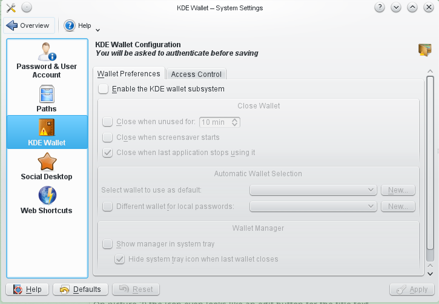

TODO 2015-Q2: move this page to solved to private wiki

Desktop: Remove the top right icon
----------------------------------
2014-12-12: SOLVED: https://forum.kde.org/viewtopic.php?f=285&t=123837&p=325691

KDE 4 and 5

Examples of inconsistency. => Suggestion to remove the icon

Has to right icon (one even looks like as if it is an edit button):

Has no icon:

another example:
