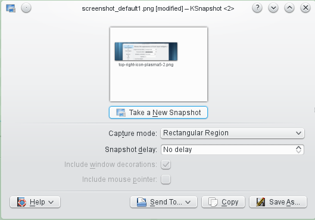

Desktop Misc
============

Font Installer [usability]: enter password for each font
--------------------------------------------------------
2014-08, not reported yet, WAIT for KF5

Current situation:

Click "Install..." and you have to enter the password **7 times** (one time for each font).

WISH: only be asked one time.

Font Installer [usability]: wrong kind of message box
-----------------------------------------------------
2014-10, not reported yet, WAIT for KF5

This should be an information box and not error box:

Thunderbird [bug]: Drag and Drop attachment
-------------------------------------------
2014-06, not solved since 2007

Drag and Drop of attachment files from Mozilla Thunderbird to the KDE Desktop is not working. The appearing menu shows “Link here” and “Cancel” instead of “Copy here”.

Bug exists since 2007 in TB: [Bug 377621 - Drag and Drop attachments to desktop or folders doesn't work ](https://bugzilla.mozilla.org/show_bug.cgi?id=377621)

Plasma [usability]: flash modal
-------------------------------
2014-10-26, WAIT for KF5, not reported yet, no existing bug searched yet

A modal dialog should flash or similar when the gray dolphin window is clicked.

Currently it does nothing.

Plasma [usability]: Remove the top right icon
----------------------------------------------
KDE 4 and 5

Examples of inconsistency. => Suggestion to remove the icon

Has to right icon (one even looks like as if it is an edit button):

Has no icon:

Plasma [usability]: ! Plus/minus file selection "buttons" should have hover effect
--------------------------------------------------------------------------------
2014-09-20, WAIT for KF5, not reported yet, no existing bug searched yet

Current situation: confusing for people: click on the text of a file or on the icon which happens to have the plus/minus symbol have different actions:
1. Selection, 2. add to selection

Good example but only works when preview images are enabled:

Mouse not hover: 

Mouse hover: 

SUGGESTION:
Add a hover effect to the plus/minus button so that the user can see that there is a different operation.

Plasma [usability]: Panel unlock und lock should be at the same location
------------------------------------------------------------------------
2014-08-27, WAIT for KF5, not reported yet
Current situation:
1. Right click on panel
2. Choose "Unlock widgets"
3. Right click on panel
4. Choose submenu "Panel options"
5. Choose "Lock widgets"

SUGGESTION:
Step 4 should be removed.
