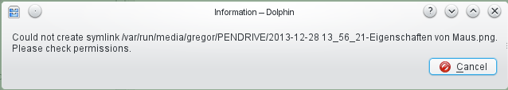
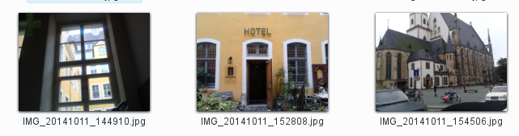
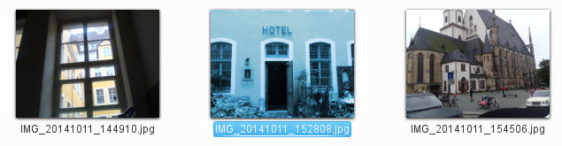
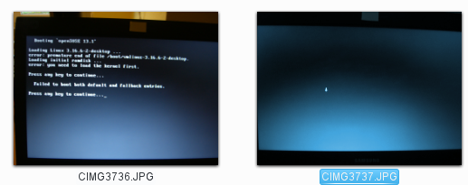
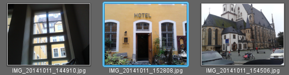

Bugs, annoyances and wishes / KDE UI / Dolphin
==============================================
On this page: dolphin related topics | [Go up to main page](struct-main.md)

kurlnavigator [usability] Navigate to parent folder should select child folder
------------------------------------------------------------------------------
reported here: https://bugs.kde.org/show_bug.cgi?id=335616, discussed on: kde-usability@kde.org

The usability team approves the new behaviour.
To the question if there is a use case to keep the current behaviour there was no answer
(mail from Heiko Tietze on kde-usability@kde.org, 14/06/14 11:29, "[KDE Usability] Dolphin/KUrlNavigator: setUrl should select child folder item of last URL if available").

todo: add some screenshots to demonstrate

Dolphin [usability, symlinks]: Copy symlink to USB stick fails
--------------------------------------------------------------
v4.11.5, 2014-11, not reported yet, WAIT for KF5

Current situation:

1. DND a folder that contains symlinks to files to an USB stick drive which is FAT32 formatted.
2. The following information box appears and the copy process is aborted:



SUGGESTION:
Instead of the information a question should be asked:
"The source contains symlinks. Would you like to resolve the symlinks and copy the original files?"


Dolphin [wish, symlinks]: Symlink --> Show original file
--------------------------------------------------------
v4.11.5, 2014, not reported yet, WAIT for KF5

There is currently no quick way to navigate to the original file or folder behind a symlink.

see also [ Bug 336194 - "Show Original Directory" in context menu on symlinked folder on desktop does not work](https://bugs.kde.org/show_bug.cgi?id=336194)


Dolphin [wish]: Drag and Drop to compress
-----------------------------------------
v4.11.5, 2014, not reported yet, WAIT for KF5

TODO: make it public to community (first: check latest plasma)

When dropping selected files and or folders to some folder the user gets a menu with the following options:

### CURRENT

  * Move here
  * Copy here
  * Link here

When dropping an archive file (zip, rar, tgz etc.) there is already an “Extract here” menu item.

### SUGGESTED
Add a new item with submenu items taken from the standard Compress context menu.

  * Compress here >
    * Here
    * As ZIP Archive
    * As RAR Archive
    * …
    * Compress To…

### Use cases where current methods are inconvenient
  * Goal is to compress a local folder on an external drive (e.g. to archive the folder away).
  With suggested method it is easy to minimize the data will be transferred from one drive to the other.


Dolphin [usability]: Rotate selected images using context menu or button
------------------------------------------------------------------------
v4.11.5, 2014
reported here: https://bugs.kde.org/show_bug.cgi?id=311127,
currently marked as "resolved downstream" (i.e. ask your favorite distribution),
contributed to discussion:
```
I am also a user who likes to do simple image rotation correction directly
in file browser in the following manner:
1) enable image preview,
2) eye-scan for wrongly rotated images,
3) select these images with Ctrl+click,
4) invoke the "rotate by 90degree function" via context menu (or toolbar).
For mass rotation gwenview used the kipiplugin found here:
gwenview --> Plugins --> Images --> Rotate Left/Right (Ctrl+Shift+Left/Right).
Maybe this could be integrated.
```

* see also:
  * Kim (Kde Image Menu) 0.9.5 (KDE 4.x): http://kde-apps.org/content/show.php?content=11505 (KDE service menu)
  * http://mylinuxramblings.wordpress.com/2011/02/20/mini-how-to-manipulate-images-from-within-your-kde4-file-manager-without-using-an-external-program/
    * "In fact I fail to understand why this is no shipped as standard with KDE4 in all distributions."
      though I find the presented menu a bit too bloated.

Dolphin [usability]: Selected images become wrong colored
---------------------------------------------------------
v4.11.5, 2014, not reported yet (first find out if there maybe is already an option), WAIT for KF5

Current situation: It is highly confusing if I look at my pictures which become false colored. I am regularly startled for a second until I realise it is just the selection

No selection:


False colors of one image selected:


Dark image selected:


SUGGESTION: just make border
 (the screenshot is taken from gwenview; for dolphin I would also highlight the filename as in the second screenshot)

