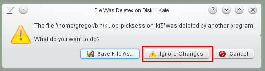

Bugs, annoyances and wishes / KDE UI
====================================
This page collects issues I stumbled on when using Linux with KDE.

* [Desktop Misc](struct-desktop-misc.md)

dolphin [several]
-----------------
[Bugs, annoyances and wishes / KDE UI / Dolphin](struct-dolphin.md)

ksnapshot [several]
-------------------
### Speed up "Send to..." menu
* https://bugs.kde.org/show_bug.cgi?id=312495
* see [dev/kde-community](../dev/kde-community.md)


### Make "Send to..." configurable

Current situation: the menu is crowed with over 20 entries and takes up to a few seconds to load.

SUGGESTION: Add item "Configure this menu".
All kipi plugin entries should be present by default and the Configure dialog should
allow to exclude undesired items. In addition, it should be possible to define user
defined commands to edit images.

### Add "Edit with..."

Current situation: one can send the image to another application and then ksnapshot loses control over the image.

SUGGESTION:
1. Add "Edit with..." where user can choose an external application
2. After edit is complete the ksnapshot preview image is updated with the changes made in the external application
3. User can use Send To... to send image to target.

### Add option for 100% zoom

Current situation: the preview image zoomed to fit which makes it cumbersome to view it 100% for pixel perfectness.

SUGGESTION: add option to zoom to 100%.
If image is too large, scrollbars should be shown. Or at least the image should not be zoom more than 100%.

### Reversed check boxes

see [Reversed check boxes in ksnapshot](http://agateau.com/2010/common-user-interface-mistakes-in-kde-applications-part-2-dialog-layouts/)

### Send To printer a la greenshot

...with options to rotate, scale and align image to target paper size and format.

Mouse - KDE Control Module: mouse too fast / add constant deceleration
----------------------------------------------------------------------
Status: reported on kde-devel mailing list (todo: when?).
todo: submit a pull request with KF5

Current situation:
Mouse pointer moves too fast.

SUGGESTION:
Add option to control "deceleration" value (todo: is this an X thing or also Wayland?):


This is how it looks on Windows 7: 

See also:

* see Thread: Mimicking "Windows" Mouse Sensitivity (http://ubuntuforums.org/showthread.php?t=748412)
* see http://lists.x.org/archives/xorg-mentors/2006/000023.html

home-fixmouse:

```
#!/bin/bash

# from here https://www.google.de/search?q=linux+slow+down+mouse&ie=utf-8&oe=utf-8&rls=org.mozilla:en-US:official&client=firefox-a&gws_rd=cr&ei=vpeOUom7JoSctAaVzoHIBQ#q=opensuse+mouse+too+fast&rls=org.mozilla:en-US%3Aofficial
# to here https://wiki.archlinux.org/index.php/Mouse_acceleration
#

# using xset
############
# seems not to work that good

# using xinput
##############
# $ xinput list
# $ xinput list-props 14  or   $ xinput list-props <mouse> <brand>

xinput --set-prop 14 'Device Accel Constant Deceleration' 3

# "To make it permanent, edit xorg configuration (see above) or add commands to xprofile"
# currently I use KDE Autostart
```

decelerate mouse:


[KDE Usability] Show notification if a document is sent to offline printer
--------------------------------------------------------------------------
reported 18/06/14 22:45 on kde-usability@kde.org, status: try again later and report back

```
Hello,

when I send a document to a printer which is offline (e. g. because the
USB cable is not plugged in) the print job is silently queued without
any notification.

>From the usability standpoint, would it be ok to show some kind of
notication (e. g. a tooltip on the Print Jobs plasma widget) saying that
the job was accepted but could not be printed because the printer is
offline?

Greetings

Gregor
```

Thomas Pfeiffer:
```
> Hello,
>
> when I send a document to a printer which is offline (e. g. because the
> USB cable is not plugged in) the print job is silently queued without
> any notification.

Really, it does that? Oh, that's... bad. I wonder why we haven't already had
countless complaints from users who realised, after 10 minutes of waiting for
their document to come out of the printer, that it's not plugged in.

> From the usability standpoint, would it be ok to show some kind of
> notication (e. g. a tooltip on the Print Jobs plasma widget) saying that
> the job was accepted but could not be printed because the printer is
> offline?

If a user clicks "Print", then their main task is printing. If that task fails
to be executed, the user has to be notified about that very clearly.
If the printer is connected, being turnede on automatically and the system is
just waiting for it to become ready, that's expected behavior, and there
should be no notification. If, however, the printer is not plugged in or
doesn't have any power, the print won't start unless the user fixes the
situation.
Actually, the best solution would be to show a KMessageWidget in the
application sending the print job (see
http://techbase.kde.org/Projects/Usability/HIG/MessageWidget ), but since
print jobs may come from pretty anywhere, that's not feasible in all cases.

For the case of the printer being unplugged, I'd actually vote for showing a
message dialog which tells the user that they have to plug the printer in for
the print to start, because otherwise they might never know what's wrong.

If the printer is plugged in, but has to be turned on manually (I have such a
printer), a dialog might be too much because the user might have clicked
"print" first and then turns on the printer. In that case, a notification
telling the user that the print will start when the printer is ready may be
enough.

Can we reliably distinguish between these two situations?
```

Heiko Tietze:
```
>> Hello,
>>
>> when I send a document to a printer which is offline (e. g. because the
>> USB cable is not plugged in) the print job is silently queued without
>> any notification.
>
> If the printer is plugged in, but has to be turned on manually (I have such
> a printer), a dialog might be too much because the user might have clicked
> "print" first and then turns on the printer. In that case, a notification
> telling the user that the print will start when the printer is ready may be
> enough.
>
> Can we reliably distinguish between these two situations?

I'm not sure if we have to blame KDE at all in this case. HP, for instance,
has it own driver and settings stuff. And the communication runs over CUPS (or
alternative frameworks) as far as I know.
```

Plasma [usability]: warn about low disk space on root
-----------------------------------------------------
v4.11.5, 2014, discussed on kde-usability@kde.org,
reported with https://bugs.kde.org/show_bug.cgi?id=340582 "Free Space Notifier" should also report full root, WAIT
(duplicate https://bugs.kde.org/show_bug.cgi?id=240863)

Current situation:
the "Free space notifier" (systemsetting -> system admin -> startup & shutdown -> service manager -> startup services,
see https://forum.kde.org/viewtopic.php?f=22&t=100802) only works for the home dir.
**TODO**: find out where "Free space notifier" is officially documented and if the check is only done at startup or regularly.

SUGGESTION:
Make it also work for the root dir because a full root can lead to failing of system package upgrades and other things.
See also file:///usr/share/kde4/config.kcfg/freespacenotifier.kcfg

Mails:
```
Subject: [KDE Usability] Show warning when disk space on root (/) is low
Date: Tue, 01 Jul 2014 20:39:51 +0200
From: Gregor Mi <codestruct@posteo.org>
Reply-To: KDE Usability Project <kde-usability@kde.org>
To: kde-usability@kde.org

Hi,

when trying to update an openSUSE computer I ran into the following
scenario:

1. Use Apper from the notification area to install the proposed updates.
2. Apper aborts at some point and shows the message "aborted by user".
3. After some searching I found out that the root partition was full
because of a large /tmp/ directory.

=> Wouldn't it be nice if the user gets notified about low disk space on
root?

I found that there exists an module called "Free Space Notifier" [1].
Does anything speak against extending it to also monitor and notify
about the root partition (and maybe propose to delete /tmp/)?

Best regards

Gregor

[1] http://askubuntu.com/questions/21317/what-is-free-space-notifier
```

```
Subject: Re: [KDE Usability] Show warning when disk space on root (/) is low
Date: Wed, 02 Jul 2014 12:20 +0200
From: Sebastian Kügler <sebas@kde.org>
Reply-To: KDE Usability Project <kde-usability@kde.org>
To: kde-usability@kde.org

On Tuesday, July 01, 2014 15:51:35 Celeste Lyn Paul wrote:
> I think that would be a great feature. However, scanning / would have to be
> done as sudo and not in regular user mode.

Just for getting the info about file-system usage and capacity, no root
privileges are needed.
```

```
In freespacenotifier.cpp the method KDiskFreeSpaceInfo::freeSpaceInfo is
used to determine the free disk space. I don't know how it works exactly
but probably one don't has to worry about details (like who has access
to which files) because it uses mount point information and does not
need to scan every file.

// Gregor
```

See also:

* https://bugs.kde.org/show_bug.cgi?id=336943 RESOLVED INVALID
* https://bugzilla.novell.com/show_bug.cgi?id=885909 RESOLVED DUPLICATE
* https://bugzilla.novell.com/show_bug.cgi?id=857630 RESOLVED FIXED

Service Menu: image -> Actions -> Resize
----------------------------------------
Current situation: Right click on image file -> Actions -> Convert To (png, jpg etc.)

**SUGGESTION:**
Right click on image file -> Actions -> Resize:

* 800x800 (max, keep aspect ratio)
* 800x800> (shrink only, smaller images stay the same) (http://stackoverflow.com/questions/6384729/only-shrink-larger-images-using-imagemagick-to-a-ratio)
  * `$ convert zzz.png -resize '800x800>' zzz1.png`
* 800 (max w, keep aspect ratio)
* x800 (max h, keep aspect ratio)

see also http://www.howtogeek.com/109369/how-to-quickly-resize-convert-modify-images-from-the-linux-terminal/
see also http://www.imagemagick.org/script/command-line-options.php#resize

More specific:
Right click on image file -> Actions:

* Downsize to max width and height
  * 100
  * 256
  * 512
  * 1024
  * 2048
* Resize %
  * 25
  * 50
  * 75

TODO: Where to suggest this menu to be added to the std service menu in KDE?


kdevelop [usability]: Notify user when debug symbols are missing
----------------------------------------------------------------
already reported: https://bugs.kde.org/show_bug.cgi?id=327760


Usability: Put Trashcan on Desktop by default
---------------------------------------------
2014-06-16, wait for KF5 and see below

Current situation: the average user has to **add the Trashcan on KDE Desktop manually**:

* it is a plasma widget and it is called Trashcan which can be added via Add Widgets…

Found here: http://forums.opensuse.org/showthread.php/477049-Putting-Home-amp-Trashcan-on-KDE-Desktop-openSUSE-12-1

WISH: the trash can should be present by default, see my [reply](https://forums.opensuse.org/showthread.php/477049-Putting-Home-amp-Trashcan-on-KDE-Desktop-openSUSE-12-1?p=2671343#post2671343), 26-Oct-2014, 11:40.


```
26-Oct-2014, 14:56
john_hudson

Welcome to the forums. When KDE4 was introduced, Dolphin was introduced as the new file manager. This incorporates the Trashcan on the left hand side. [...]
```

```
27-Oct-2014, 01:43
wolfi323

And you can also find the Trashcan in the K-Menu on the "Computer" tab.

Regarding not having a Trashcan on the Desktop by default:
This could of course easily be added to openSUSE's default settings (upstream doesn't even have a folder view by default).
Maybe propose it on the opensuse-kde or opensuse-factory mailinglists, or file a feature request.
http://lists.opensuse.org/opensuse-kde/
http://lists.opensuse.org/opensuse-factory/
https://features.opensuse.org/
But it's of course too late for 13.2 now.

I think in earlier versions a link to the Trashcan was indeed copied to the ~/Desktop folder when the user first logged in. No idea why that got dropped.
```

see also my comment on [openFATE - openSUSE feature tracking > #310994 Restore button in recycle bin](https://features.opensuse.org/310994)

[#318123 Put the Trashcan on the Desktop by default](https://features.opensuse.org/318123)
```
Trashcan is often-used feature which users expect to find easily.

Currently one has to add the Trashcan to the desktop manually in a way that is not quite intuitive for novice users: https://forums.opensuse.org/showthread.php/477049-Putting-Home-amp-Trashcan-on-KDE-Desktop-openSUSE-12-1?p=2671343

I suggest to put the Trashcan on the Desktop by default.

This would save many users from searching the internet for how to add it. Deleting it when not desired is much easier.
```

Status: WAIT (since 2014-11-09, last update: 2014-11-09)


kdiskfree [usability]: F5 to refresh / also refresh when USB drives get disconnected
------------------------------------------------------------------------------------
2014-11-08, WAIT for KF5, not reported yet
Version v0.15, Using KDE Development Platform 4.11.5

* F5 should be the shortcut for refresh
* Refresh should also update the list (currently e.g. when USB device were disconnected, the list still has the entries of removed devices)
* see also
    * [Bug 313018 - Kdiskfree keeps showing an unmounted device](https://bugs.kde.org/show_bug.cgi?id=313018)
    * [Bug 94452 - kdf stops updating free space information](https://bugs.kde.org/show_bug.cgi?id=94452)


Kate (new/unreported): handling of deleted files
------------------------------------------------
2014-09, WAIT for KF5, not reported yet

Current situation:

1. delete file,



2. Click Ignore, 3. Manually close tab.png

=> Not quite convenient.

SUGGESTION:
"The file was deleted from disk. You have the following options:

* Close the document tab
* Keep the document tab open
* Save File as..."


new/unreported: copy large files to USB stick / strange progress
----------------------------------------------------------------
 Warum steht da so oft 0KB pro sec?

 250MB⁄s, lange Pause , Peak, lange Pause etc. Normal?


openSUSE: "Beautiful one-click-install"
---------------------------------------
add comment 2014-11-09 (link to image broken) to https://features.opensuse.org/309503


See also
--------
  * Aurélien Gâteau's article series about [Common user interface mistakes in KDE applications](http://agateau.com/article-series/common-ui-mistakes-in-kde-applications/)
