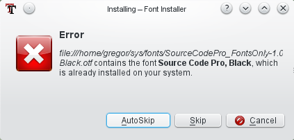
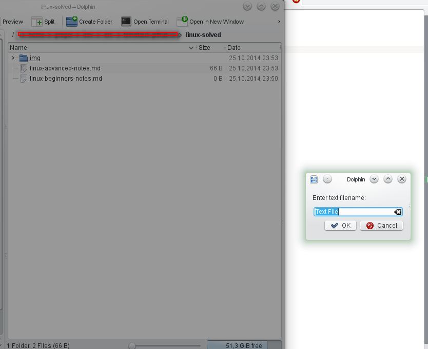

Bugs, annoyances and wishes / KDE UI
====================================
This page collects issues I stumbled on when using Linux with KDE.

TODO: move content from here: http://codestruct.jimdo.com/

ksnapshot [several]
----------------
### Make "Send to..." configurable

Current situation: the menu is crowed with over 20 entries and takes up to a few seconds to load.

SUGGESTION: Add item "Configure this menu".
All kipi plugin entries should be present by default and the Configure dialog should
allow to exclude undesired items. In addition, it should be possible to define user
defined commands to edit images.

### Add "Edit with..."

Current situation: one can send the image to another application and then ksnapshot loses control over the image.

SUGGESTION:
1. Add "Edit with..." where user can choose an external application
2. After edit is complete the ksnapshot preview image is updated with the changes made in the external application
3. User can use Send To... to send image to target.

### Add option for 100% zoom

Current situation: the preview image zoomed to fit which makes it cumbersome to view it 100% for pixel perfectness.

SUGGESTION: add option to zoom to 100%.
If image is too large, scrollbars should be shown. Or at least the image should not be zoom more than 100%.

### Reversed check boxes

see [Reversed check boxes in ksnapshot](http://agateau.com/2010/common-user-interface-mistakes-in-kde-applications-part-2-dialog-layouts/)

### Send To printer a la greenshot

...with options to rotate, scale and align image to target paper size and format.

kurlnavigator [usability] Navigate to parent folder should select child folder
------------------------------------------------------------------------------
reported here: https://bugs.kde.org/show_bug.cgi?id=335616, discussed on: kde-usability@kde.org

The usability team approves the new behaviour.
To the question if there is a use case to keep the current behaviour there was no answer
(mail from Heiko Tietze on kde-usability@kde.org, 14/06/14 11:29, "[KDE Usability] Dolphin/KUrlNavigator: setUrl should select child folder item of last URL if available").

todo: add some screenshots to demonstrate

Dolphin [usability, symlinks]: Copy symlink to USB stick fails
--------------------------------------------------------------
v4.11.5, 2014-11, not reported yet, WAIT for KF5

Current situation:

1. DND a folder that contains symlinks to files to an USB stick drive which is FAT32 formatted.
2. The following information box appears and the copy process is aborted:


SUGGESTION:
Instead of the information a question should be asked:
"The source contains symlinks. Would you like to resolve the symlinks and copy the original files?"


Dolphin [wish, symlinks]: Symlink --> Show original file
--------------------------------------------------------
v4.11.5, 2014, not reported yet, WAIT for KF5

There is currently no quick way to navigate to the original file or folder behind a symlink.

see also [ Bug 336194 - "Show Original Directory" in context menu on symlinked folder on desktop does not work](https://bugs.kde.org/show_bug.cgi?id=336194)


Dolphin [wish]: Drag and Drop to compress
-----------------------------------------
v4.11.5, 2014, not reported yet, WAIT for KF5

TODO: make it public to community (first: check latest plasma)

When dropping selected files and or folders to some folder the user gets a menu with the following options:

### CURRENT

  * Move here
  * Copy here
  * Link here

When dropping an archive file (zip, rar, tgz etc.) there is already an “Extract here” menu item.

### SUGGESTED
Add a new item with submenu items taken from the standard Compress context menu.

  * Compress here >
    * Here
    * As ZIP Archive
    * As RAR Archive
    * …
    * Compress To…

### Use cases where current methods are inconvenient
  * Goal is to compress a local folder on an external drive (e.g. to archive the folder away).
  With suggested method it is easy to minimize the data will be transferred from one drive to the other.


Dolphin [usability]: Rotate selected images using context menu or button
------------------------------------------------------------------------
v4.11.5, 2014
reported here: https://bugs.kde.org/show_bug.cgi?id=311127,
currently marked as "resolved downstream" (i.e. ask your favorite distribution),
contributed to discussion:
```
I am also a user who likes to do simple image rotation correction directly
in file browser in the following manner:
1) enable image preview,
2) eye-scan for wrongly rotated images,
3) select these images with Ctrl+click,
4) invoke the "rotate by 90degree function" via context menu (or toolbar).
For mass rotation gwenview used the kipiplugin found here:
gwenview --> Plugins --> Images --> Rotate Left/Right (Ctrl+Shift+Left/Right).
Maybe this could be integrated.
```

* see also:
  * Kim (Kde Image Menu) 0.9.5 (KDE 4.x): http://kde-apps.org/content/show.php?content=11505 (KDE service menu)
  * http://mylinuxramblings.wordpress.com/2011/02/20/mini-how-to-manipulate-images-from-within-your-kde4-file-manager-without-using-an-external-program/
    * "In fact I fail to understand why this is no shipped as standard with KDE4 in all distributions."
      though I find the presented menu a bit too bloated.

Dolphin [usability]: Selected images become wrong colored
---------------------------------------------------------
v4.11.5, 2014, not reported yet (first find out if there maybe is already an option), WAIT for KF5

Current situation: It is highly confusing if I look at my pictures which become false colored. I am regularly startled for a second until I realise it is just the selection

No selection:


False colors of one image selected:


SUGGESTION: just make border
 (the screenshot is taken from gwenview; for dolphin I would also highlight the filename as in the second screenshot)


[KDE Usability] Show notification if a document is sent to offline printer
--------------------------------------------------------------------------
reported 18/06/14 22:45 on kde-usability@kde.org, status: try again later and report back

```
Hello,

when I send a document to a printer which is offline (e. g. because the
USB cable is not plugged in) the print job is silently queued without
any notification.

>From the usability standpoint, would it be ok to show some kind of
notication (e. g. a tooltip on the Print Jobs plasma widget) saying that
the job was accepted but could not be printed because the printer is
offline?

Greetings

Gregor
```

Thomas Pfeiffer:
```
> Hello,
>
> when I send a document to a printer which is offline (e. g. because the
> USB cable is not plugged in) the print job is silently queued without
> any notification.

Really, it does that? Oh, that's... bad. I wonder why we haven't already had
countless complaints from users who realised, after 10 minutes of waiting for
their document to come out of the printer, that it's not plugged in.

> From the usability standpoint, would it be ok to show some kind of
> notication (e. g. a tooltip on the Print Jobs plasma widget) saying that
> the job was accepted but could not be printed because the printer is
> offline?

If a user clicks "Print", then their main task is printing. If that task fails
to be executed, the user has to be notified about that very clearly.
If the printer is connected, being turnede on automatically and the system is
just waiting for it to become ready, that's expected behavior, and there
should be no notification. If, however, the printer is not plugged in or
doesn't have any power, the print won't start unless the user fixes the
situation.
Actually, the best solution would be to show a KMessageWidget in the
application sending the print job (see
http://techbase.kde.org/Projects/Usability/HIG/MessageWidget ), but since
print jobs may come from pretty anywhere, that's not feasible in all cases.

For the case of the printer being unplugged, I'd actually vote for showing a
message dialog which tells the user that they have to plug the printer in for
the print to start, because otherwise they might never know what's wrong.

If the printer is plugged in, but has to be turned on manually (I have such a
printer), a dialog might be too much because the user might have clicked
"print" first and then turns on the printer. In that case, a notification
telling the user that the print will start when the printer is ready may be
enough.

Can we reliably distinguish between these two situations?
```

Heiko Tietze:
```
>> Hello,
>>
>> when I send a document to a printer which is offline (e. g. because the
>> USB cable is not plugged in) the print job is silently queued without
>> any notification.
>
> If the printer is plugged in, but has to be turned on manually (I have such
> a printer), a dialog might be too much because the user might have clicked
> "print" first and then turns on the printer. In that case, a notification
> telling the user that the print will start when the printer is ready may be
> enough.
>
> Can we reliably distinguish between these two situations?

I'm not sure if we have to blame KDE at all in this case. HP, for instance,
has it own driver and settings stuff. And the communication runs over CUPS (or
alternative frameworks) as far as I know.
```

Plasma [usability]: warn about low disk space on root
-----------------------------------------------------
v4.11.5, 2014, discussed on kde-usability@kde.org,
reported with https://bugs.kde.org/show_bug.cgi?id=340582 "Free Space Notifier" should also report full root
WAIT, see also https://bugs.kde.org/show_bug.cgi?id=240863

Current situation:
the "Free space notifier" (systemsetting -> system admin -> startup & shutdown -> service manager -> startup services,
see https://forum.kde.org/viewtopic.php?f=22&t=100802) only works for the home dir.

SUGGESTION:
Make it also work for the root dir because a full root can lead to failing of system package upgrades and other things.
See also file:///usr/share/kde4/config.kcfg/freespacenotifier.kcfg

Mails:
```
Subject: [KDE Usability] Show warning when disk space on root (/) is low
Date: Tue, 01 Jul 2014 20:39:51 +0200
From: Gregor Mi <codestruct@posteo.org>
Reply-To: KDE Usability Project <kde-usability@kde.org>
To: kde-usability@kde.org

Hi,

when trying to update an openSUSE computer I ran into the following
scenario:

1. Use Apper from the notification area to install the proposed updates.
2. Apper aborts at some point and shows the message "aborted by user".
3. After some searching I found out that the root partition was full
because of a large /tmp/ directory.

=> Wouldn't it be nice if the user gets notified about low disk space on
root?

I found that there exists an module called "Free Space Notifier" [1].
Does anything speak against extending it to also monitor and notify
about the root partition (and maybe propose to delete /tmp/)?

Best regards

Gregor

[1] http://askubuntu.com/questions/21317/what-is-free-space-notifier
```

```
Subject: Re: [KDE Usability] Show warning when disk space on root (/) is low
Date: Wed, 02 Jul 2014 12:20 +0200
From: Sebastian Kügler <sebas@kde.org>
Reply-To: KDE Usability Project <kde-usability@kde.org>
To: kde-usability@kde.org

On Tuesday, July 01, 2014 15:51:35 Celeste Lyn Paul wrote:
> I think that would be a great feature. However, scanning / would have to be
> done as sudo and not in regular user mode.

Just for getting the info about file-system usage and capacity, no root
privileges are needed.
```

```
In freespacenotifier.cpp the method KDiskFreeSpaceInfo::freeSpaceInfo is
used to determine the free disk space. I don't know how it works exactly
but probably one don't has to worry about details (like who has access
to which files) because it uses mount point information and does not
need to scan every file.

// Gregor
```

See also:

* https://bugs.kde.org/show_bug.cgi?id=336943
* https://bugzilla.novell.com/show_bug.cgi?id=885909
* https://bugzilla.novell.com/show_bug.cgi?id=857630 [reported as fixed]


Font Installer [usability]: wrong kind of message box
-----------------------------------------------------
2014-10, WAIT for KF5

This should be an information box and not error box:




Thunderbird [bug]: Drag and Drop attachment
-------------------------------------------
2014-06, not solved since 2007

Drag and Drop of attachment files from Mozilla Thunderbird to the KDE Desktop is not working. The appearing menu shows “Link here” and “Cancel” instead of “Copy here”.

Bug exists since 2007 in TB: [Bug 377621 - Drag and Drop attachments to desktop or folders doesn't work ](https://bugzilla.mozilla.org/show_bug.cgi?id=377621)


Usability: Put Trashcan on Desktop by default
---------------------------------------------
2014-06-16, wait for KF5, (todo: is this a Plasma or openSUSE issue?)

Current situation: the average user has to **add the Trashcan on KDE Desktop manually**:

* it is a plasma widget and it is called Trashcan which can be added via Add Widgets…

Found here: http://forums.opensuse.org/showthread.php/477049-Putting-Home-amp-Trashcan-on-KDE-Desktop-openSUSE-12-1

WISH: the trash can should be present by default, see my [reply](https://forums.opensuse.org/showthread.php/477049-Putting-Home-amp-Trashcan-on-KDE-Desktop-openSUSE-12-1?p=2671343#post2671343).


Plasma [usability]: flash modal
-------------------------------
2014-10-26, WAIT for KF5

A modal dialog should flash or similar when the gray dolphin window is clicked.

Currently it does nothing.



See also
--------
  * Aurélien Gâteau's article series about [Common user interface mistakes in KDE applications](http://agateau.com/article-series/common-ui-mistakes-in-kde-applications/) (TODO: read)
