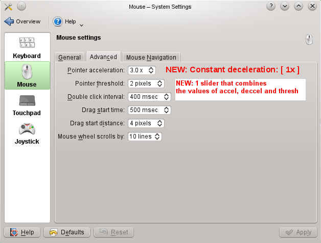
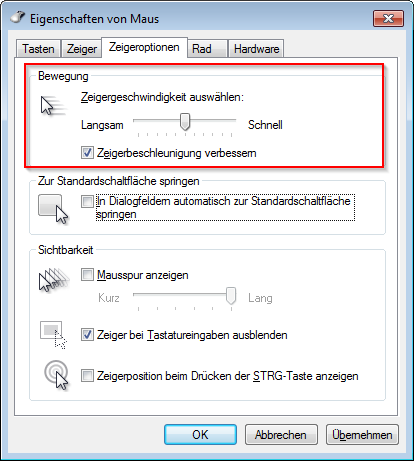
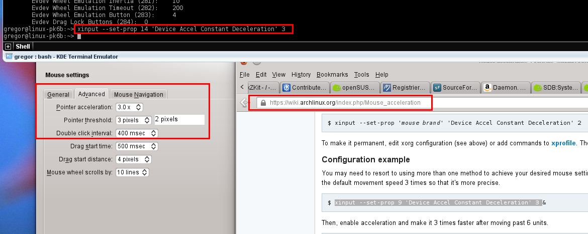
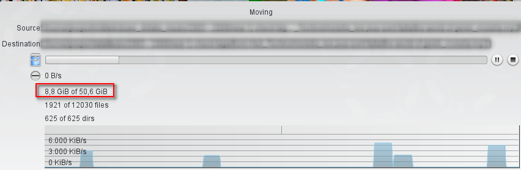
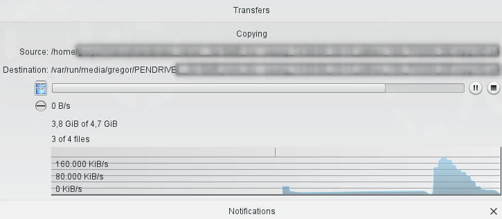

Bugs, annoyances and wishes / KDE UI
====================================
This page collects issues I stumbled on when using Linux with KDE.

* [Desktop Misc](struct-desktop-misc.md)

dolphin [several]
-----------------
[Bugs, annoyances and wishes / KDE UI / Dolphin](struct-dolphin.md)


ksnapshot [several]
-------------------
### Make "Send to..." configurable

Current situation: the menu is crowed with over 20 entries and takes up to a few seconds to load.

SUGGESTION: Add item "Configure this menu".
All kipi plugin entries should be present by default and the Configure dialog should
allow to exclude undesired items. In addition, it should be possible to define user
defined commands to edit images.

### Add "Edit with..."

Current situation: one can send the image to another application and then ksnapshot loses control over the image.

SUGGESTION:
1. Add "Edit with..." where user can choose an external application
2. After edit is complete the ksnapshot preview image is updated with the changes made in the external application
3. User can use Send To... to send image to target.

### Add option for 100% zoom

Current situation: the preview image zoomed to fit which makes it cumbersome to view it 100% for pixel perfectness.

SUGGESTION: add option to zoom to 100%.
If image is too large, scrollbars should be shown. Or at least the image should not be zoom more than 100%.

### Reversed check boxes

see [Reversed check boxes in ksnapshot](http://agateau.com/2010/common-user-interface-mistakes-in-kde-applications-part-2-dialog-layouts/)

### Send To printer a la greenshot

...with options to rotate, scale and align image to target paper size and format.


Mouse - KDE Control Module: mouse too fast / add constant deceleration
----------------------------------------------------------------------
Status: reported on kde-devel mailing list (todo: when?).
todo: submit a pull request with KF5

Current situation:
Mouse pointer moves too fast.

SUGGESTION:
Add option to control "deceleration" value (todo: is this an X thing or also Wayland?):



This is how it looks on Windows 7: 

See also:

* see Thread: Mimicking "Windows" Mouse Sensitivity (http://ubuntuforums.org/showthread.php?t=748412)
* see http://lists.x.org/archives/xorg-mentors/2006/000023.html

home-fixmouse:

```
#!/bin/bash

# from here https://www.google.de/search?q=linux+slow+down+mouse&ie=utf-8&oe=utf-8&rls=org.mozilla:en-US:official&client=firefox-a&gws_rd=cr&ei=vpeOUom7JoSctAaVzoHIBQ#q=opensuse+mouse+too+fast&rls=org.mozilla:en-US%3Aofficial
# to here https://wiki.archlinux.org/index.php/Mouse_acceleration
#

# using xset
############
# seems not to work that good

# using xinput
##############
# $ xinput list
# $ xinput list-props 14  or   $ xinput list-props <mouse> <brand>

xinput --set-prop 14 'Device Accel Constant Deceleration' 3

# "To make it permanent, edit xorg configuration (see above) or add commands to xprofile"
# currently I use KDE Autostart
```

decelerate mouse:




Service Menu: image -> Actions -> Resize
----------------------------------------
Current situation: Right click on image file -> Actions -> Convert To (png, jpg etc.)

**SUGGESTION:**
Right click on image file -> Actions -> Resize:

* 800x800 (max, keep aspect ratio)
* 800x800> (shrink only, smaller images stay the same) (http://stackoverflow.com/questions/6384729/only-shrink-larger-images-using-imagemagick-to-a-ratio)
  * `$ convert zzz.png -resize '800x800>' zzz1.png`
* 800 (max w, keep aspect ratio)
* x800 (max h, keep aspect ratio)

see also http://www.howtogeek.com/109369/how-to-quickly-resize-convert-modify-images-from-the-linux-terminal/
see also http://www.imagemagick.org/script/command-line-options.php#resize

More specific:
Right click on image file -> Actions:

* Downsize to max width and height
  * 100
  * 256
  * 512
  * 1024
  * 2048
* Resize %
  * 25
  * 50
  * 75

todo: suggest that this menu to be added to the std service menu in KDE


kdiskfree [usability]: F5 to refresh / also refresh when USB drives get disconnected
------------------------------------------------------------------------------------
2014-11-08, WAIT for KF5, not reported yet
Version v0.15, Using KDE Development Platform 4.11.5

* F5 should be the shortcut for refresh
* Refresh should also update the list (currently e.g. when USB device were disconnected, the list still has the entries of removed devices)
* see also
    * [Bug 313018 - Kdiskfree keeps showing an unmounted device](https://bugs.kde.org/show_bug.cgi?id=313018)
    * [Bug 94452 - kdf stops updating free space information](https://bugs.kde.org/show_bug.cgi?id=94452)


new/unreported: copy large files to USB stick / strange progress
----------------------------------------------------------------
 Warum steht da so oft 0KB pro sec?

 250MB⁄s, lange Pause , Peak, lange Pause etc. Normal?


See also
--------
  * Aurélien Gâteau's article series about [Common user interface mistakes in KDE applications](http://agateau.com/article-series/common-ui-mistakes-in-kde-applications/)
