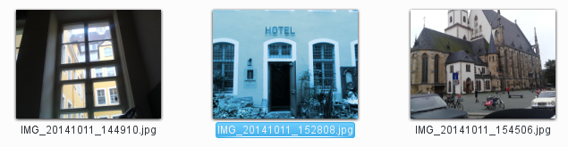

Bugs, annoyances and wishes / KDE UI
====================================
This page collects issues I stumbled on when using Linux with KDE.

TODO: move content from here: http://codestruct.jimdo.com/

ksnapshot [several]
----------------
### Make "Send to..." configurable

Current situation: the menu is crowed with over 20 entries and takes up to a few seconds to load.

SUGGESTION: Add item "Configure this menu".
All kipi plugin entries should be present by default and the Configure dialog should
allow to exclude undesired items. In addition, it should be possible to define user
defined commands to edit images.

### Add "Edit with..."

Current situation: one can send the image to another application and then ksnapshot loses control over the image.

SUGGESTION:
1. Add "Edit with..." where user can choose an external application
2. After edit is complete the ksnapshot preview image is updated with the changes made in the external application
3. User can use Send To... to send image to target.

### Add option for 100% zoom

Current situation: the preview image zoomed to fit which makes it cumbersome to view it 100% for pixel perfectness.

SUGGESTION: add option to zoom to 100%.
If image is too large, scrollbars should be shown. Or at least the image should not be zoom more than 100%.

### Reversed check boxes

see [Reversed check boxes in ksnapshot](http://agateau.com/2010/common-user-interface-mistakes-in-kde-applications-part-2-dialog-layouts/)

### Send To printer a la greenshot

...with options to rotate, scale and align image to target paper size and format.


Dolphin [usability, symlinks]: Copy symlink to USB stick fails
--------------------------------------------------------------
v4.11.5, 2014-11, not reported yet, WAIT for KF5

Current situation:

1. DND a folder that contains symlinks to files to an USB stick drive which is FAT32 formatted.
2. The following information box appears and the copy process is aborted:


SUGGESTION:
Instead of the information a question should be asked:
"The source contains symlinks. Would you like to resolve the symlinks and copy the original files?"


Dolphin [wish, symlinks]: Symlink --> Show original file
--------------------------------------------------------
v4.11.5, 2014, not reported yet, WAIT for KF5

There is currently no quick way to navigate to the original file or folder behind a symlink.

see also [ Bug 336194 - "Show Original Directory" in context menu on symlinked folder on desktop does not work](https://bugs.kde.org/show_bug.cgi?id=336194)


Dolphin [wish]: Drag and Drop to compress
-----------------------------------------
v4.11.5, 2014, not reported yet, WAIT for KF5

TODO: make it public to community (first: check latest plasma)

When dropping selected files and or folders to some folder the user gets a menu with the following options:

### CURRENT

  * Move here
  * Copy here
  * Link here

When dropping an archive file (zip, rar, tgz etc.) there is already an “Extract here” menu item.

### SUGGESTED
Add a new item with submenu items taken from the standard Compress context menu.

  * Compress here >
    * Here
    * As ZIP Archive
    * As RAR Archive
    * …
    * Compress To…

### Use cases where current methods are inconvenient
  * Goal is to compress a local folder on an external drive (e.g. to archive the folder away).
  With suggested method it is easy to minimize the data will be transferred from one drive to the other.


Dolphin [usability]: Rotate selected images using context menu or button
------------------------------------------------------------------------
v4.11.5, 2014
reported here: https://bugs.kde.org/show_bug.cgi?id=311127,
currently marked as "resolved downstream" (i.e. ask your favorite distribution),
contributed to discussion:
```
I am also a user who likes to do simple image rotation correction directly
in file browser in the following manner:
1) enable image preview,
2) eye-scan for wrongly rotated images,
3) select these images with Ctrl+click,
4) invoke the "rotate by 90degree function" via context menu (or toolbar).
For mass rotation gwenview used the kipiplugin found here:
gwenview --> Plugins --> Images --> Rotate Left/Right (Ctrl+Shift+Left/Right).
Maybe this could be integrated.
```

* see also:
  * Kim (Kde Image Menu) 0.9.5 (KDE 4.x): http://kde-apps.org/content/show.php?content=11505 (KDE service menu)
  * http://mylinuxramblings.wordpress.com/2011/02/20/mini-how-to-manipulate-images-from-within-your-kde4-file-manager-without-using-an-external-program/
    * "In fact I fail to understand why this is no shipped as standard with KDE4 in all distributions."
      though I find the presented menu a bit too bloated.

Dolphin [usability]: Selected images become wrong colored
---------------------------------------------------------
v4.11.5, 2014, not reported yet (first find out if there maybe is already an option), WAIT for KF5

Current situation: It is highly confusing if I look at my pictures which become false colored. I am regularly startled for a second until I realise it is just the selection

No selection:


False colors of one image selected:


SUGGESTION: just make border
 (the screenshot is taken from gwenview; for dolphin I would also highlight the filename as in the second screenshot)


Plasma [usability]: warn about low disk space on root
-----------------------------------------------------
v4.11.5, 2014, not reported yet?

Current situation:
the "Free space notifier" (systemsetting -> system admin -> startup & shutdown -> service manager -> startup services,
see https://forum.kde.org/viewtopic.php?f=22&t=100802) only works for the home dir.

SUGGESTION:
Make it also work for the root dir because a full root can lead to failing of system package upgrades and other things.
See also file:///usr/share/kde4/config.kcfg/freespacenotifier.kcfg


Font Installer [usability]: wrong kind of message box
-----------------------------------------------------
2014-10, WAIT for KF5

This should be an information box and not error box:


Thunderbird [bug]: Drag and Drop attachment
-------------------------------------------
2014-06, not solved since 2007

Drag and Drop of attachment files from Mozilla Thunderbird to the KDE Desktop is not working. The appearing menu shows “Link here” and “Cancel” instead of “Copy here”.

Bug exists since 2007 in TB: [Bug 377621 - Drag and Drop attachments to desktop or folders doesn't work ](https://bugzilla.mozilla.org/show_bug.cgi?id=377621)


Usability: Put Trashcan on Desktop by default
---------------------------------------------
2014-06-16, wait for KF5, (todo: is this a Plasma or openSUSE issue?)

Current situation: the average user has to **add the Trashcan on KDE Desktop manually**:

* it is a plasma widget and it is called Trashcan which can be added via Add Widgets…

Found here: http://forums.opensuse.org/showthread.php/477049-Putting-Home-amp-Trashcan-on-KDE-Desktop-openSUSE-12-1

WISH: the trash can should be present by default, see my [reply](https://forums.opensuse.org/showthread.php/477049-Putting-Home-amp-Trashcan-on-KDE-Desktop-openSUSE-12-1?p=2671343#post2671343).


Plasma [usability]: flash modal
-------------------------------
2014-10-26, WAIT for KF5

A modal dialog should flash or similar when the gray dolphin window is clicked.

Currently it does nothing.


See also
--------
  * Aurélien Gâteau's article series about [Common user interface mistakes in KDE applications](http://agateau.com/article-series/common-ui-mistakes-in-kde-applications/) (TODO: read)
